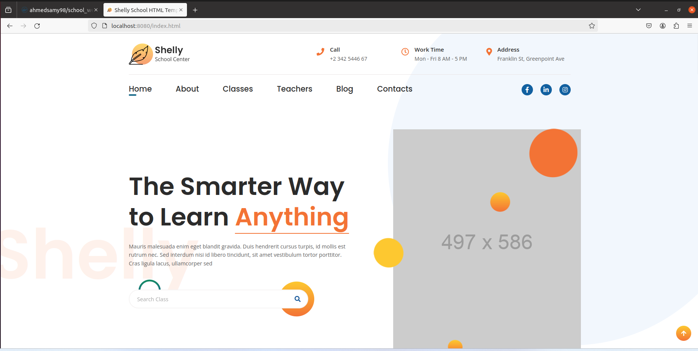

# Build-School-Website-with-Docker

This project involves building a school website image using Docker. The process includes copying code files from the host machine to a Docker container, committing the container to create a reusable image, and pushing that image to Docker Hub for easy access and deployment.

## Project Overview

In this project, I built a Docker image for a school website. The Docker image contains all necessary files and configurations to run the website without needing the code files on the host machine.

## Detailed Steps

1. **Clone the Project**:
   - Download the project repository:
     ```bash
     git clone https://github.com/MenaMagdyHalem/Course-Docker.git
     ```
   
2. **Create Dockerfile**:
   - Create a Dockerfile like in this repository.

3. **Build the Docker Image**:
   - Build the Docker image from the Dockerfile:
     ```bash
     docker build -t website_basic_image .
     ```

4. **Run the Docker Container**:
   - Run the container from the image:
     ```bash
     docker run -itd --name website -p 8080:80 website_basic_image
     ```
   - Open a web browser and navigate to `localhost:8080` to see the website.

5. **Commit the Container**:
   - Commit the running container to create a new Docker image:
     ```bash
     docker commit website website_image
     ```

6. **Tag the Docker Image**:
   - Tag the Docker image to prepare it for pushing to Docker Hub:
     ```bash
     docker tag website_image:latest ahmedsamy98/school_website:latest
     ```

7. **Push the Image to Docker Hub**:
   - Push the tagged image to Docker Hub:
     ```bash
     docker push ahmedsamy98/school_website:latest
     ```

## Results

- **Docker Image URL**:
  - The Docker image is available on Docker Hub: [ahmedsamy98/school_website](https://hub.docker.com/repository/docker/ahmedsamy98/school_website/general)
  
- **Website Snapshot**:
  - Below is a snapshot of the HTML page that appears when you run the Docker image:

  

---

This README file provides a clear and concise description of your project, including all the steps needed to build, run, and deploy the Docker image for the school website.
